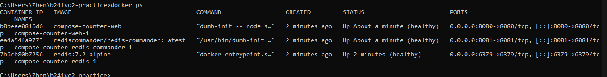
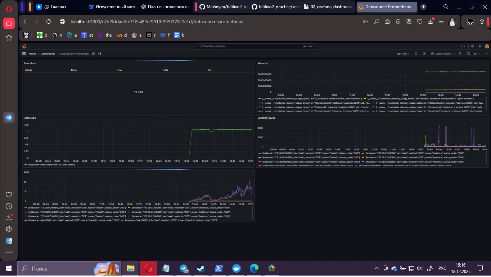
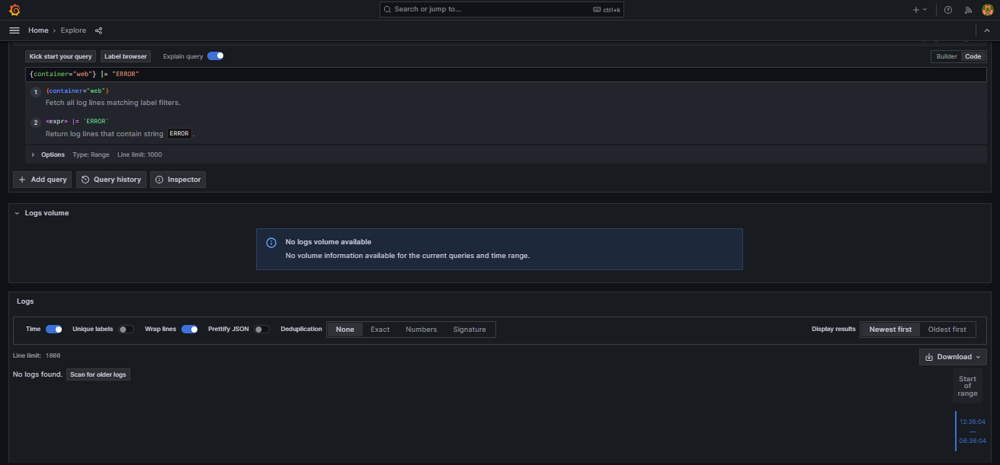

# Как сдавать практику?

1. Сделать **fork** репозитория.
> https://github.com/1FAY/b24ivo2-practice
    
2. Внести изменения и добавить артефакты по структуре:
    
```bash
├── docker-compose.yml
├── Dockerfile
├── prometheus.yml
├── grafana/
├── load/test.js
├── REPORT.md
└── screenshots/
```

3. Закоммитить по шагам (осмысленные сообщения), запушить в свой fork.
    
4. Прислать ссылку на репозиторий.
    


---

# Что должно быть внутри?

## REPORT.md / документ Word 
шаблон .md-файла:
```bash
# Отчёт по практике

- ФИО: Иванов Иван Иванович
- Группа: Б-24 ИВО-2
- Репозиторий: https://github.com/<user>/<repo>

## Задание 1. Оптимизация контейнера
- Размер образа (до → после): ___ → ___
- Пользователь процесса: вывод `id` внутри контейнера: `uid=___(___)`
- Healthcheck: что проверяет и почему такие интервалы
- Безопасность: какие флаги включены и зачем
- Скриншоты:  
  

## Задание 2. Метрики и дашборды
- Что именно собираем: список экспортёров/эндпоинтов
- Основные метрики (минимум 3) и почему они важны
- Ссылка/cкриншот дашборда:  
  
- Алерты: пример правила и Скриншот срабатывания

## Задание 3. Централизованные логи
- Схема сбора (Loki/Promtail): какие лейблы использовали
- Запрос для ошибок: `{container="web"} |= "ERROR"`
- Скриншот панели ошибок:  
  

## Задание 4. Балансировка и масштабирование
- Какой балансировщик и почему
- Реплики web: `N = ___`, как проверяли равномерность
- Canary маршрут: доли трафика и как заданы
- Скриншот нагрузки/распределения:  
  

## Задание 5. Нагрузочное тестирование и SLO
- SLO: p95 ≤ ___ ms, error rate ≤ ___%
- k6 профиль нагрузки: ramp-up/ramp-down
- Итоговые метрики (таблица):
| Метрика | Факт | SLO | Ок? |

- Выводы и план улучшений (2–3 пункта)
```


## Шаблоны/заготовки

### `.dockerignore` (в корне)
```gitignore
.git
node_modules
dist
.*swp
.DS_Store
backups
screenshots
```

### `prometheus.yml` (скелет)
```yaml
global:
  scrape_interval: 15s
  evaluation_interval: 15s

scrape_configs:
  - job_name: 'prometheus'
    static_configs: [{ targets: ['prometheus:9090'] }]

  - job_name: 'web'
    metrics_path: /metrics
    static_configs: [{ targets: ['web:8080'] }]

  - job_name: 'cadvisor'
    static_configs: [{ targets: ['cadvisor:8080'] }]

  - job_name: 'node'
    static_configs: [{ targets: ['node_exporter:9100'] }]

  - job_name: 'redis'
    static_configs: [{ targets: ['redis_exporter:9121'] }]
```

### `load/test.js` (для k6)
```js
import http from 'k6/http';
import { check, sleep } from 'k6';

export let options = {
  thresholds: {
    http_req_failed: ['rate<=0.001'], // ≤0.1%
    http_req_duration: ['p(95)<=200'], // p95 ≤ 200ms
  },
  stages: [
    { duration: '30s', target: 20 },
    { duration: '1m',  target: 50 },
    { duration: '2m',  target: 100 },
    { duration: '1m',  target: 0 },
  ],
};

const BASE = __ENV.BASE_URL || 'http://localhost:8080';

export default function () {
  let res = http.get(`${BASE}/`);
  check(res, { 'status 200': r => r.status === 200 });

  let h = http.get(`${BASE}/health`);
  check(h, { 'health ok': r => r.status === 200 && r.body.includes('"ok"') });

  sleep(1);
}
```

### `grafana/` (структура)
```bash
grafana/
├── provisioning/
│   ├── datasources/
│   │   └── prometheus.yml # datasource=Prometheus
│   └── dashboards/
│       └── dashboards.yml # автоподхват json-дашбордов
└── dashboards/
    └── app-observability.json # ваш экспортированный дашборд
```

### `grafana/provisioning/datasources/prometheus.yml` (пример)
```yaml
apiVersion: 1
datasources:
  - name: Prometheus
    type: prometheus
    access: proxy
    url: http://prometheus:9090
    isDefault: true
```


---

# Рекомендации по коммитам и имени ветки

- Ветка: `devops-practice-v3` (или `practice3`).
    
- Коммиты по шагам:  
    `feat(docker): multistage build + non-root`,  
    `feat(metrics): prometheus + exporters`,  
    `feat(logs): loki/promtail`,  
    `feat(scale): traefik + replicas`,  
    `test(load): k6 scenario`,  
    `docs: REPORT with screenshots`.


---

# Задания
## Задание 1. Оптимизация контейнера

**Требования:** уменьшить образ, убрать root, зафиксировать версии, добавить healthcheck и корректный entrypoint.

**Ход выполнения:**

1. Переписать `Dockerfile` на multi-stage (с кешированием зависимостей).
    
2. Запускать процесс от непривилегированного пользователя.
    
3. Добавить `.dockerignore`.
    
4. В `docker-compose.yml`:
    
    - `healthcheck` для `web`,
        
    - `restart: unless-stopped`,
        
    - ресурсы: `deploy.resources.limits` (CPU/Memory),
        
    - безопасность: `read_only: true`, `cap_drop: ["ALL"]`, `no-new-privileges:true`, `ulimits.nofile`.
        
5. Зафиксировать версии базовых образов и сервисов (например, `redis:7.2`).
    

**Ожидаемый результат:**

- Образ `web` стал ощутимо меньше.
    
- Процесс в контейнере не root (проверка `id`).
    
- `docker compose ps` — все сервисы `Up (healthy)`.
    


---

## Задание 2. Метрики и дашборды

**Требования:** получать сигналы о состоянии и возможность нагружать систему.

**Ход выполнения:**

1. Добавить стек метрик:
    
    - `prometheus`,
        
    - `cAdvisor` (метрики Docker),
        
    - `node-exporter` (метрики хоста),
        
    - `redis-exporter` (метрики Redis).
        
2. Для приложения выдать `/metrics` (например, через middleware) 
	> **Потребуется изменить исходный код программы**
    
3. В `grafana` создать дашборд:
    
    - RPS/latency,
        
    - CPU/Mem контейнеров,
        
    - Redis ops/sec, latency, количество ключей.
        
4. Настроить `Alertmanager` на базовые алерты (latency > X, Redis down, OOM kill).
    

**Ожидаемый результат:**

- Grafana показывает RPS/latency веба, загрузку контейнеров и метрики Redis.
    
- Срабатывает test-alert при искусственно завышенном пороге.
    


---

## Задание 3. Централизованные логи

**Требования:** собрать логи всех сервисов в одном месте с поиском по полям.

**Ход выполнения:**

1. Развернуть `loki` + `promtail` и подключить логи всех контейнеров.
    
2. В Grafana добавить datasource Loki и построить граф: ошибки по сервисам (`{container="web"} |= "ERROR"`).
    

**Ожидаемый результат:**

- В Grafana по Loki видны логи `web`, `redis`, `redis-commander` и системные из cAdvisor.
    
- Есть панель «Errors by service (5m)».
    


---

## Задание 4. Балансировка и масштабирование

**Требование:**  масштабировать `web` и грамотно балансировать трафик.

**Ход выполнения**

1. Добавить реверс-прокси: `traefik` или `nginx` перед `web`.
    
2. Поднять `web` в 3 реплики (Compose v2: `deploy.replicas: 3`) и убедиться, что счётчик визитов корректен (Redis — общий).
    
3. Включить проверки готовности (`/health`) на балансировщике.
    
4. Сделать «blue/green» или Canary-маршрут (например, 90% на `web`, 10% на `web-canary`).
    

**Ожидаемый результат:**

- При нагрузке (см. след. задание) балансировщик равномерно распределяет запросы.
    
- Canary трафик ходит в нужной пропорции.
    


---

## Задание 5. Нагрузочное тестирование и SLO

**Требование:** сформулировать SLO/ошибочную бюджет и проверить их под нагрузкой.

**Ход выполнения:**

1. Написать скрипт k6 (`load/test.js`) с профилем ramp-up/ramp-down и выборкой страниц (`/`, `/health`).
    
2. Запустить `k6` (как контейнер) против балансировщика.
    
3. Определить SLO: например, **p95 latency ≤ 200ms**, **ошибки ≤ 0.1%**.
    
4. Сопоставить результаты с метриками Prometheus/Grafana, оформить вывод.
    

**Ожидаемый результат:**

- Отчёт с графиками и выводом — выдерживаем/не выдерживаем SLO, план улучшения.
    
