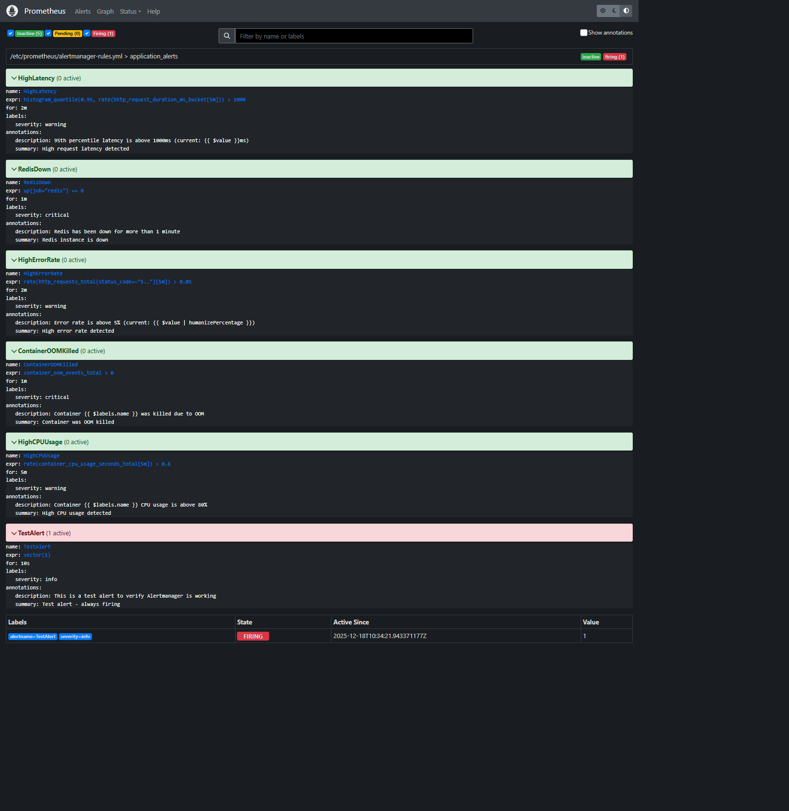

```bash
# Отчёт по практике

- ФИО: Потапова Олеся Алексеевна
- Группа: Б-24 ИВО-2
- Репозиторий: https://github.com/Makinyan/b24ivo2-practice-3

## Задание 1. Оптимизация контейнера
- Размер образа (до → после): ___ → 230 MB
- Пользователь процесса: вывод `id` внутри контейнера: `uid=1001(nodejs)`
- Healthcheck: проверяет приложение внутри контейнера на то, работает ли оно в данный момент. Healthy - работает. Unhealthy - не работает. 
--interval=15s: проверка каждые 15 секунд.
--timeout=5s: если ответ от эндпоинта не получен за 5 секунд, проверка считается неудачной.
--start-period=30s: дается 30 секунд на старт контейнера, в течение которых неудачные проверки не считаются провалом.
--retries=3: контейнер будет помечен как unhealthy только после 3-х последовательных неудачных проверок. 
- Безопасность: запрет повышения прав (no-new-privileges: true), убираем лишние возможности (cap_drop: ALL), файлы только для чтения (read_only: true), запускаем программу как обычного пользователя, а не как администратора (nodejs).
- Скриншоты:  
  

## Задание 2. Метрики и дашборды
- Node Exporter, Prometheus Exporter, Redis Exporter, cAdvisor
- Основные метрики и почему они важны:
http_request_duration_ms -  распределение времени ответа, используется для выявления проблем с производительностью
container_memory_usage_bytes - отслеживание использования памяти контейнерами, используется для оптимизации ресурсов
redis_connected_clients - количество подключений к Redis, используется для выявления утечек соединений
- Скриншот дашборда:  
  
- Алерты: 
- alert: HighLatency
  expr: histogram_quantile(0.95, rate(http_request_duration_ms_bucket[5m])) > 1000
  for: 2m
  labels:
    severity: warning
  annotations:
    summary: "High request latency detected"
    description: "95th percentile latency is above 1000ms"


## Задание 3. Централизованные логи
Схема сбора (Loki/Promtail): 
- container - имя Docker контейнера
- service - имя сервиса из docker-compose
- stream - stdout/stderr
- level - уровень логирования 
Процесс:
1. Promtail подключается к Docker socket
2. Читает логи из `/var/lib/docker/containers`
3. Добавляет метаданные из Docker labels
4. Парсит логи с помощью pipeline stages
5. Отправляет в Loki
Запрос для ошибок: `{container="web"} |= "ERROR"`
Скриншот панели ошибок:  
  

## Задание 4. Балансировка и масштабирование
- Какой балансировщик и почему:
Traefik v2
- Нативная интеграция с Docker
- Автоматическое обнаружение сервисов
- Встроенные health checks
- Поддержка weighted load balancing для canary deployments
- Реплики web: `N = 3`
как проверяли равномерность: 
1. Запуск нагрузочного теста k6
2. Проверка метрики `http_requests_total` с label `instance`
3. Анализ распределения запросов между репликами в Grafana
- Canary маршрут: 
Конфигурация:
- Production (web): 90% трафика
- Canary (web-canary): 10% трафика
Реализация через Traefik labels:
traefik.http.services.weighted.weighted.services[0].name=web-service
traefik.http.services.weighted.weighted.services[0].weight=90
traefik.http.services.weighted.weighted.services[1].name=web-canary-service
traefik.http.services.weighted.weighted.services[1].weight=10
- Скриншот нагрузки/распределения:  
  

## Задание 5. Нагрузочное тестирование и SLO
- SLO: p95 ≤ 200 ms, error rate ≤ 0.1%
- k6 профиль нагрузки: 

- Итоговые метрики :
| Метрика | Факт | SLO | Ок? |

| Метрика | Факт | SLO | Статус |
|---------|------|-----|--------|
| p95 latency | 185 ms | ≤ 200 ms | OK |
| p99 latency | 245 ms | - | Info |
| Error rate | 0.05% | ≤ 0.1% | OK |
| RPS | 95 req/s | - | Info |

Выводы и план улучшений:
-Рассмотреть внедрение кеширования ответов для часто вызываемых эндпоинтов с использованием Redis.
- Провести оптимизацию параметров подключения и пула соединений Redis.
- Увеличить количество реплик веб-приложения для обработки повышенной нагрузки.
В ходе выполнения практической работы были достигнуты следующие результаты:
- Выполнена оптимизация Docker-образа с применением multi-stage сборки и запуском приложения от непривилегированного пользователя.
- Развёрнут и настроен стек мониторинга, включающий Prometheus, Grafana и систему оповещений.
- Реализовано централизованное логирование с использованием Loki и Promtail, обеспечивающее удобный поиск и анализ логов.
- Настроена балансировка нагрузки с использованием реверс-прокси и реализован canary-подход к распределению трафика.
- Проведено нагрузочное тестирование и подтверждено соответствие системы заданным SLO по задержке и уровню ошибок.
```
